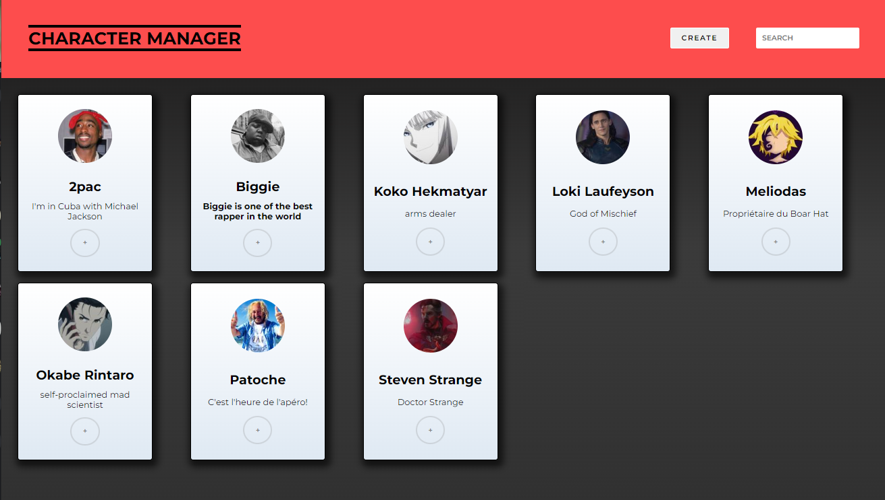
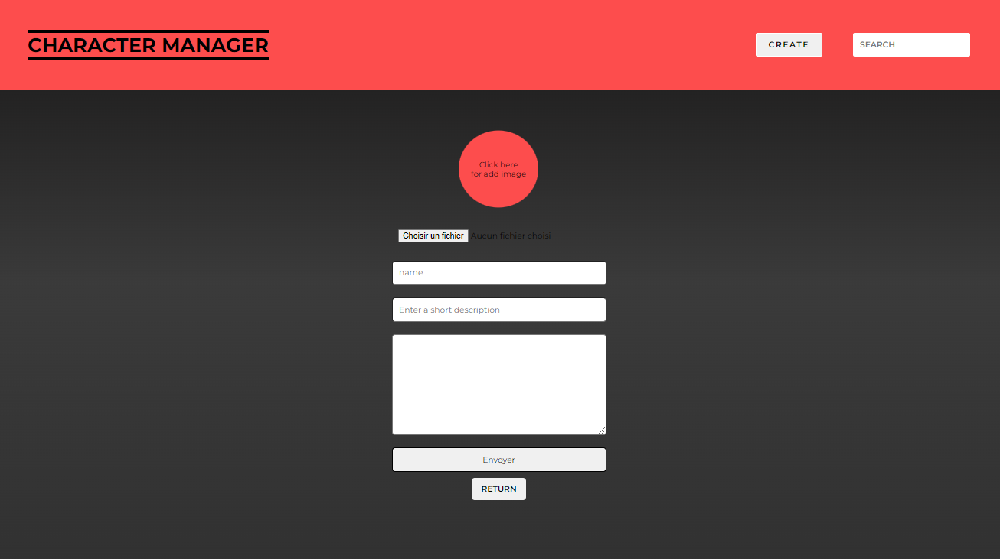
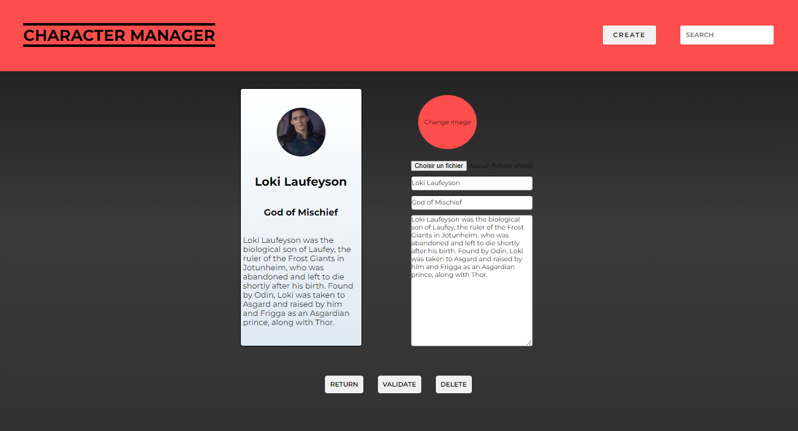

# character-manager-js

### Team

-   Quentin -> https://github.com/QuentinMotte
-   Henri -> https://github.com/henrihals

## consolidation challenge @Becode

### Objectives

-   Use best JS practices
-   Read documentation and test a REST API
-   Use a REST API with HTTP requests
-   Create a typical asynchronous flow : send asynchronous (promises or async/await) requests to a remote server and process the results
-   DOM manipulation: changing the DOM based on results of HTTP requests

### What's the job

In this project, we need to use the Character Database API https://character-database.becode.xyz/ to make/fetch a Character Manager.

This project need to have :

-   A characters list page

    

-   A character creation page

    

-   A character editor & single character page

    

### Technologies

-   HTML
-   SASS
-   JAVASCRIPT
-   VITE
-   GIT/GITHUB
